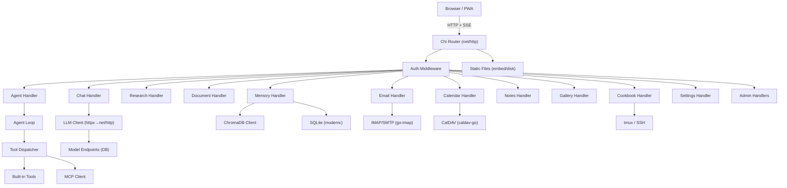

# Design Document

## 1. Overview

Theseus is a Go rewrite of the Odysseus Python/FastAPI backend. The frontend (`static/`) is reused verbatim. The Go binary replaces `uvicorn app:app` and exposes the same REST + SSE API surface. The design prioritizes:

- **API compatibility** — every JSON shape, route path, and SSE event format matches the Python original so the frontend works without modification.
- **Single binary** — all Go code compiles to one executable; static assets are embedded via `embed.FS` or served from disk.
- **Idiomatic Go** — standard library where possible, minimal third-party dependencies, explicit error handling.
- **Incremental migration** — the spec is structured so features can be implemented and tested one module at a time.

---

## 2. Architecture



### Key layers

| Layer | Responsibility |
|---|---|
| `cmd/theseus/main.go` | Entry point, wiring, startup |
| `internal/server` | HTTP router setup, middleware chain |
| `internal/auth` | AuthManager, session tokens, TOTP, privileges |
| `internal/db` | SQLite schema, migrations, query helpers |
| `internal/llm` | LLM client, streaming, dead-host tracking |
| `internal/agent` | Agent loop, tool dispatch, MCP client |
| `internal/tools` | Built-in tool implementations |
| `internal/chat` | Chat handler, context building, RAG injection |
| `internal/research` | Deep research engine |
| `internal/memory` | Memory manager, ChromaDB client, skills |
| `internal/email` | IMAP/SMTP, pollers, AI triage |
| `internal/calendar` | Calendar CRUD, CalDAV sync, iCal |
| `internal/notes` | Notes, checklists, reminders |
| `internal/gallery` | Image library, EXIF, editor drafts |
| `internal/cookbook` | hwfit, model catalog, tmux serving |
| `internal/search` | Multi-provider web search |
| `internal/settings` | Settings/features JSON, TTL cache |
| `internal/storage` | Atomic file I/O, secret encryption |
| `internal/webhook` | Outgoing webhooks, HMAC signing |
| `internal/tts` | TTS/STT provider abstraction |

---

## 3. Components and Interfaces

### 3.1 HTTP Router

Use `github.com/go-chi/chi/v5`. All routes mirror the Python originals exactly.

```go
// internal/server/router.go
func NewRouter(deps *Deps) http.Handler {
    r := chi.NewRouter()
    r.Use(SecurityHeadersMiddleware)
    r.Use(RequestTimeoutMiddleware(45*time.Second, exemptPrefixes))
    r.Use(AuthMiddleware(deps.Auth))
    // mount sub-routers per feature
    r.Mount("/api/auth",     authRouter(deps))
    r.Mount("/api/chat",     chatRouter(deps))
    r.Mount("/api/sessions", sessionRouter(deps))
    // ... etc
    r.Handle("/static/*",   staticHandler())
    r.NotFound(spaHandler())
    return r
}
```

### 3.2 Auth Manager

```go
// internal/auth/manager.go
type Manager struct {
    configPath   string
    sessionsPath string
    config       AuthConfig   // loaded from data/auth.json
    sessions     map[string]SessionEntry // token -> {username, expiry}
    mu           sync.RWMutex
}

type User struct {
    PasswordHash string            `json:"password_hash"`
    IsAdmin      bool              `json:"is_admin"`
    Privileges   map[string]any    `json:"privileges"`
    TOTPSecret   string            `json:"totp_secret,omitempty"`
    Created      float64           `json:"created"`
}

func (m *Manager) Login(username, password, totpCode string) (token string, err error)
func (m *Manager) ValidateToken(token string) (username string, ok bool)
func (m *Manager) CreateUser(username, password string, isAdmin bool) error
func (m *Manager) DeleteUser(username, requestingUser string) error
func (m *Manager) IsAdmin(username string) bool
func (m *Manager) HasPrivilege(username, privilege string) bool
```

Token format: 32-byte random hex, stored as bcrypt hash in sessions map, persisted to `data/sessions.json`.

### 3.3 Database

Use `modernc.org/sqlite` (pure Go, no CGO). Schema defined in `internal/db/schema.go` as a series of `CREATE TABLE IF NOT EXISTS` + `ALTER TABLE ... ADD COLUMN IF NOT EXISTS` statements run at startup.

```go
// internal/db/db.go
type DB struct {
    *sql.DB
}

func Open(dsn string) (*DB, error)
func (db *DB) Migrate() error  // runs all migrations idempotently
```

Tables (direct mapping from Python SQLAlchemy models):
- `sessions`, `chat_messages`, `documents`, `document_versions`
- `gallery_albums`, `gallery_images`
- `email_accounts`
- `model_endpoints`, `mcp_servers`
- `comparisons`, `signatures`, `api_tokens`, `webhooks`
- `user_tools`, `user_tool_data`, `crew_members`
- `scheduled_tasks`, `task_runs`
- `editor_drafts`, `memories`
- `notes`, `calendar_cals`, `calendar_events`
- `contacts` (local fallback)

Encrypted columns (email passwords, API keys, signatures) use AES-256-GCM with a key from `data/.app_key`.

### 3.4 LLM Client

```go
// internal/llm/client.go
type Client struct {
    httpClient  *http.Client
    deadHosts   map[string]time.Time  // host -> cooldown expiry
    hostFails   map[string]int
    mu          sync.Mutex
}

func (c *Client) Stream(ctx context.Context, req StreamRequest) (<-chan StreamChunk, error)
func (c *Client) Call(ctx context.Context, req CallRequest) (string, error)

type StreamRequest struct {
    URL         string
    Model       string
    Messages    []Message
    Headers     map[string]string
    Temperature float64
    MaxTokens   int
    Tools       []ToolSchema  // for function calling
}
```

SSE parsing: read `data:` lines, unmarshal JSON, emit `StreamChunk{Delta, FinishReason, ToolCalls}`.

Dead-host logic: after 2 consecutive connect failures, mark host dead for 20s. Any success resets the counter.

### 3.5 Agent Loop

```go
// internal/agent/loop.go
func StreamAgentLoop(ctx context.Context, req AgentRequest, out chan<- SSEEvent) error

type AgentRequest struct {
    SessionID   string
    Messages    []llm.Message
    Owner       string
    Privileges  map[string]any
    ActiveDocID string
    MCPManager  *mcp.Manager
}
```

Loop logic (mirrors Python):
1. Call `llm.Stream` with current messages + tool schemas in system prompt.
2. Accumulate response; parse fenced code blocks (`parse_tool_blocks`) and/or `tool_calls`.
3. For each tool block: call `tools.Execute(ctx, block, owner)`.
4. Append tool result to messages; repeat up to `MAX_AGENT_ROUNDS=20`.
5. Emit all intermediate output as SSE events.

### 3.6 Tool Dispatcher

```go
// internal/tools/dispatcher.go
func Execute(ctx context.Context, block ToolBlock, owner string, deps *Deps) (string, error)
```

Dispatches to individual `do_*` functions by `block.ToolType`. Each tool function is in its own file under `internal/tools/`:

`bash.go`, `python.go`, `web_search.go`, `files.go`, `documents.go`, `memory.go`, `notes.go`, `calendar.go`, `email.go`, `image.go`, `tasks.go`, `skills.go`, `models.go`, `shell.go`, `mcp_tool.go`, `app_api.go`, `cookbook_tools.go`

### 3.7 MCP Client

```go
// internal/mcp/manager.go
type Manager struct {
    servers map[string]*ServerConn
    mu      sync.RWMutex
}

type ServerConn struct {
    ID       string
    Name     string
    Tools    []ToolSchema
    // stdio: cmd + pipes; SSE: http client
}

func (m *Manager) Connect(ctx context.Context, cfg ServerConfig) error
func (m *Manager) ListTools() []ToolSchema
func (m *Manager) Call(ctx context.Context, serverID, toolName string, args map[string]any) (string, error)
```

Use `github.com/mark3labs/mcp-go` for the MCP protocol client (stdio + SSE transports).

### 3.8 Deep Research Engine

```go
// internal/research/engine.go
type Engine struct {
    llm    *llm.Client
    search *search.Client
}

func (e *Engine) Run(ctx context.Context, req ResearchRequest, out chan<- SSEEvent) error
```

Implements the Think→Search→Extract→Synthesize loop from `src/deep_research.py`. Produces an HTML report via `internal/research/report.go` (port of `src/visual_report.py`).

### 3.9 Memory Manager

```go
// internal/memory/manager.go
type Manager struct {
    db     *db.DB
    chroma *ChromaClient  // nil if unavailable
}

func (m *Manager) Add(ctx context.Context, entry MemoryEntry) error
func (m *Manager) Search(ctx context.Context, query, owner string, limit int) ([]MemoryEntry, error)
func (m *Manager) Delete(ctx context.Context, id, owner string) error
```

ChromaDB client uses the HTTP REST API (`/api/v1/collections`, `/api/v1/collections/{id}/query`). Falls back to SQL keyword search when ChromaDB is unreachable.

### 3.10 Email

```go
// internal/email/imap.go  — IMAP operations via go-imap
// internal/email/smtp.go  — SMTP sending via net/smtp
// internal/email/poller.go — background polling loop
// internal/email/triage.go — AI summarize/tag/urgency
```

Use `github.com/emersion/go-imap/v2` and `github.com/emersion/go-message` for IMAP. Use `net/smtp` for sending. Passwords stored AES-256-GCM encrypted.

### 3.11 Calendar

```go
// internal/calendar/store.go  — SQLite CRUD
// internal/calendar/caldav.go — CalDAV pull sync via go-webdav
// internal/calendar/ical.go   — .ics import/export
```

Use `github.com/emersion/go-webdav` for CalDAV. Sync runs on calendar open and every 15 minutes via the scheduler.

### 3.12 Cookbook / hwfit

```go
// internal/cookbook/hardware.go  — GPU/RAM detection
// internal/cookbook/catalog.go   — model catalog from embedded JSON
// internal/cookbook/serve.go     — tmux session management
// internal/cookbook/ssh.go       — remote server SSH commands
```

Hardware detection: parse `nvidia-smi` output for VRAM; read `/proc/meminfo` for RAM; use `runtime.NumCPU()`. Model catalog embedded from `services/hwfit/data/hf_models.json`. Tmux management via `os/exec`.

### 3.13 Search

```go
// internal/search/client.go
type Client struct {
    providers []Provider
    cache     *ttlcache.Cache[string, []Result]
}

func (c *Client) Search(ctx context.Context, query string, n int) ([]Result, error)
func (c *Client) FetchContent(ctx context.Context, url string) (string, error)
```

Providers: SearXNG, DuckDuckGo (scrape), Brave API, Google PSE, Tavily, Serper. Fallback chain from settings.

### 3.14 Settings

```go
// internal/settings/settings.go
var cache struct {
    mu       sync.RWMutex
    settings map[string]any
    features map[string]bool
    settingsAt time.Time
    featuresAt time.Time
}

func Get(key string) any
func GetBool(key string) bool
func Save(settings map[string]any) error
func SaveFeatures(features map[string]bool) error
```

TTL: 2 seconds. Atomic writes via `internal/storage/atomic.go`.

### 3.15 Secret Storage

```go
// internal/storage/secrets.go
func Encrypt(plaintext string) (string, error)  // returns "enc:<base64>"
func Decrypt(ciphertext string) (string, error) // handles legacy plaintext
```

Key: 32-byte random key stored at `data/.app_key` (mode 0600), created on first boot. Algorithm: AES-256-GCM with random 12-byte nonce prepended to ciphertext.

---

## 4. Data Models

All DB models are direct Go struct equivalents of the Python SQLAlchemy models. Key structs:

```go
// internal/db/models.go

type Session struct {
    ID             string
    Name           string
    EndpointURL    string
    Model          string
    Owner          sql.NullString
    RAG            bool
    Archived       bool
    Folder         sql.NullString
    Headers        []byte  // JSON
    LastAccessedAt time.Time
    LastMessageAt  sql.NullTime
    MessageCount   int
    IsImportant    bool
    Mode           sql.NullString
    CrewMemberID   sql.NullString
    CreatedAt      time.Time
    UpdatedAt      time.Time
}

type ChatMessage struct {
    ID        string
    SessionID string
    Role      string
    Content   string
    Metadata  sql.NullString  // JSON
    Timestamp time.Time
}

type Document struct {
    ID             string
    SessionID      sql.NullString
    Title          string
    Language       sql.NullString
    CurrentContent string
    VersionCount   int
    IsActive       bool
    Archived       bool
    Owner          sql.NullString
    // ... email provenance fields
}

type Memory struct {
    ID        string
    Text      string
    Category  string
    Source    string
    Owner     sql.NullString
    SessionID sql.NullString
    Timestamp int64
}

type Note struct {
    ID        string
    Title     string
    Content   sql.NullString
    Items     sql.NullString  // JSON checklist
    NoteType  string
    Color     sql.NullString
    Label     sql.NullString
    Pinned    bool
    Archived  bool
    DueDate   sql.NullString
    Owner     sql.NullString
    // ...
}
```

---

## 5. Error Handling

- All handlers return structured JSON errors: `{"error": "message", "detail": "..."}`.
- HTTP status codes match the Python original (400, 401, 403, 404, 422, 429, 500, 503, 504).
- LLM errors: dead-host cooldown returns 503 with `{"error": "LLM endpoint unreachable"}`.
- DB errors: logged at ERROR level; return 500 to client without leaking internal details.
- Tool errors: returned as tool result strings (not HTTP errors) so the agent loop can handle them.
- Panics: recovered by Chi's `middleware.Recoverer`; logged with stack trace; return 500.
- Context cancellation: all long-running operations respect `ctx.Done()` and clean up resources.

---

## 6. Testing Strategy

### Unit tests
- `internal/auth` — login, token validation, privilege checks, TOTP
- `internal/llm` — dead-host logic, SSE parsing, retry behavior
- `internal/agent` — tool block parsing, loop termination, round limits
- `internal/tools` — each tool function with mocked dependencies
- `internal/search` — provider fallback chain, cache behavior
- `internal/settings` — TTL cache, atomic save/load
- `internal/storage` — encrypt/decrypt round-trip, key generation

### Integration tests
- Full HTTP handler tests using `httptest.NewServer`
- DB migration idempotency (run migrations twice, assert no error)
- Chat streaming: mock LLM server → assert SSE events
- Agent loop: mock tool execution → assert correct round count

### Compatibility tests
- For each API route, assert the Go response JSON shape matches the Python original (golden files from a running Python instance).

### Risk flags
- **MCP protocol**: `mcp-go` library is relatively new; if it proves unstable, fall back to a minimal hand-rolled stdio/SSE client.
- **ChromaDB HTTP API**: version-lock the client to ChromaDB 0.4.x API; the REST API changed between versions.
- **PTY shell streaming**: `github.com/creack/pty` is well-tested but PTY behavior differs on macOS vs Linux; test on both.
- **CalDAV**: `go-webdav` has incomplete REPORT support for some servers; may need custom PROPFIND fallback for Apple Calendar.

---

## 7. Key Design Decisions

### Why Chi over Gin/Echo?
Chi is stdlib-compatible (`http.Handler`), has no magic, and makes middleware composition explicit. The existing Python routes map cleanly to Chi sub-routers.

### Why modernc/sqlite over mattn/go-sqlite3?
`modernc.org/sqlite` is pure Go (no CGO), so the binary cross-compiles without a C toolchain. Performance is slightly lower but acceptable for a single-user workspace.

### Why embed static assets?
`//go:embed static/*` makes the binary truly self-contained. A `--static-dir` flag can override to serve from disk for development.

### Session token format
32-byte random hex (64 chars) stored as a bcrypt hash in `data/sessions.json`. This matches the Python implementation and allows the same cookie format — important for users migrating from Python to Go without re-logging in.

### Streaming (SSE)
All streaming endpoints use `text/event-stream` with `Transfer-Encoding: chunked`. The Go handler flushes after each `data:` line using `http.Flusher`. This matches the Python `StreamingResponse` behavior exactly.

### Concurrency model
- Each HTTP request runs in its own goroutine (standard Go net/http).
- The agent loop runs in the request goroutine; tool calls that need subprocess execution use `exec.CommandContext` with the request context.
- Background pollers (email, CalDAV, task scheduler) run as long-lived goroutines started at boot.
- The settings cache uses `sync.RWMutex` for safe concurrent reads.

### Secret encryption migration
On startup, scan `email_accounts`, `model_endpoints`, `signatures`, and `api_tokens` for unencrypted values (those not prefixed with `enc:`). Encrypt and update in place. This mirrors the Python migration behavior.
